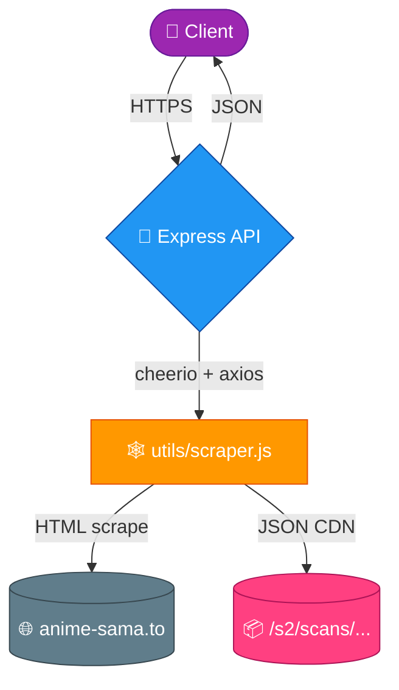

<div align="center">

# 🎌 Anime-Sama API

### ⚡ Real-time scraping API for [anime-sama.to](https://anime-sama.to) — Anime episodes + Manga scans, unified ⚡


</div>

---

## ✨ Features

| | |
|---|---|
| 🔍 **Search** | Find any title (anime or scan) |
| 🆕 **Recent** | Latest added/updated content |
| 📅 **Planning** | Weekly schedule with `vf` / `vostfr` / `anime` / `scan` filters |
| 🔥 **Popular** | Trending + classics |
| 🎲 **Recommendations** | Random discovery |
| 📖 **Details** | Full info including all seasons AND scan variants |
| 🎬 **Episodes** | Episode list + streaming sources |
| 📚 **Scans** | Chapter list + page images for manga readers |
| 🔗 **Streaming** | Direct embed extraction |
| 🏷️ **`contentType`** | Every item tagged `anime` \| `film` \| `oav` \| `kai` \| `scan` |

---

## 📡 Endpoints

| Method | Endpoint | Description |
|:---:|---|---|
| `GET` | `/api/search?query=naruto` | 🔍 Search any title |
| `GET` | `/api/recent` | 🆕 Latest additions |
| `GET` | `/api/planning?day=today&filter=scan` | 📅 Weekly schedule |
| `GET` | `/api/popular` | 🔥 Trending + classics |
| `GET` | `/api/recommendations?page=1&limit=20` | 🎲 Random discovery |
| `GET` | `/api/anime/[animeId]` | 📖 Full details (anime + scan variants) |
| `GET` | `/api/seasons/[animeId]` | 🗂️ All seasons + scan variants |
| `GET` | `/api/episodes/[animeId]?season=saison1&language=VOSTFR` | 🎬 Episode list (anime mode) |
| `GET` | `/api/episodes/[animeId]?season=scan&language=VF` | 📚 Chapter list (scan mode, auto-detected) |
| `GET` | `/api/episodes/[animeId]?season=scan&language=VF&chapter=1` | 🖼️ Single chapter with page images |
| `GET` | `/api/episode-by-id/[episodeId]` | ▶️ Streaming sources for an episode |
| `GET` | `/api/embed?url=[animeUrl]` | 🔗 Extract sources from any anime-sama URL |

---

## 📚 Scan reader flow (3 calls)

```mermaid
flowchart LR
    A[📖 /api/anime/one-piece] -->|seasons[].contentType=='scan'| B[📚 /api/episodes/one-piece<br/>?season=scan&language=VF]
    B -->|chapters[].number| C[🖼️ /api/episodes/one-piece<br/>?season=scan&chapter=N]
    C -->|images[]| D[(🌸 Manga Reader)]

    style A fill:#4a90e2,stroke:#2e5c8a,color:#fff
    style B fill:#ff9800,stroke:#c66900,color:#fff
    style C fill:#ff4081,stroke:#b0003a,color:#fff
    style D fill:#4caf50,stroke:#2e7d32,color:#fff
```

```bash
# 1️⃣  Discover scan variants
curl /api/anime/one-piece
# → seasons[] includes { value: "scan", type: "Scan", contentType: "scan", ... }

# 2️⃣  List chapters (lightweight, no images)
curl "/api/episodes/one-piece?season=scan&language=VF"
# → { realName: "One Piece Couleur", count: 1004, chapters: [{ number, title, pageCount }, ...] }

# 3️⃣  Load images for one chapter
curl "/api/episodes/one-piece?season=scan&language=VF&chapter=1"
# → { chapter: { number: 1, pageCount: 55, images: [".../1/1.jpg", ".../1/2.jpg", ...] } }
```

> 💡 The `/api/episodes` endpoint **auto-switches to scan mode** when `season` starts with `scan` (e.g. `scan`, `scan_noir-et-blanc`).

---

## 🏗️ Architecture



---

## 🚀 Development

```bash
npm install
npm start
```

Then open **`http://localhost:5000`** for live interactive documentation.

---

## ☁️ Deployment

[](https://vercel.com/new)

Fits exactly within Vercel's **12 serverless function** Hobby tier limit.
⚠️ Adding any new file under `/api/` requires removing or merging an existing one.

---

<div align="center">

### 🌟 Version 4.0.0 — Anime + Scans unified 🌟

*Made with ❤️ for the anime & manga community*

</div>
